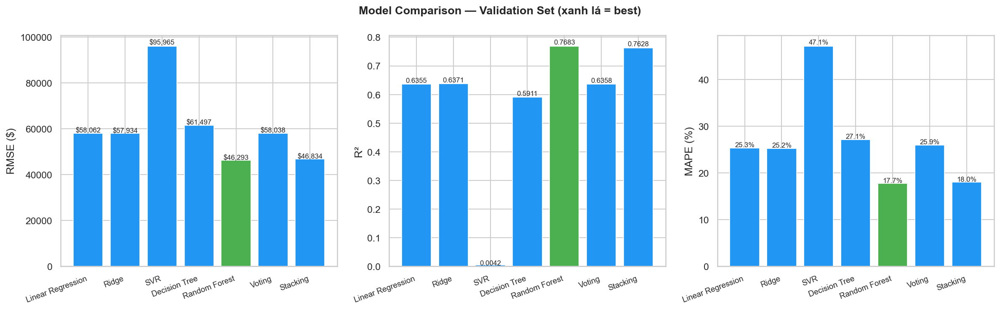
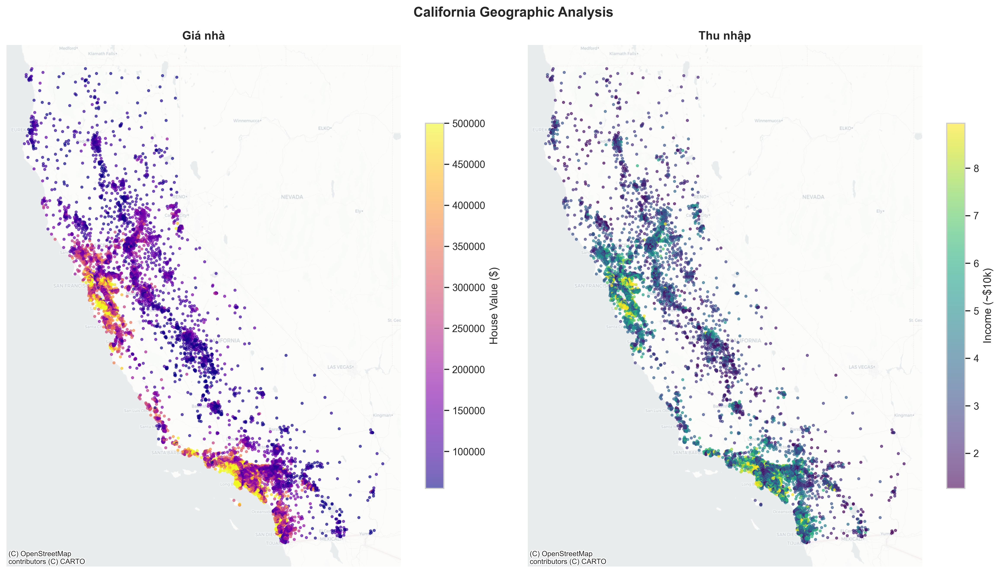

# California Housing Price Prediction


An end-to-end machine learning product that predicts California house values from census and geospatial features. The project covers exploratory analysis, feature engineering, model benchmarking, a FastAPI inference service, a React dashboard, prediction history, and data drift monitoring.

This repository is designed to show more than a notebook: it demonstrates how a trained model can be evaluated, served, validated, visualized, and monitored in a small full-stack ML application.

## Recruiter Snapshot

- Built a complete ML workflow from EDA and model comparison to API inference and frontend interaction.
- Best tracked model: `stacking_pipeline` with test RMSE `44,379.81`, test MAE `28,569.61`, and test R2 `0.7933`.
- Engineered domain features such as rooms per household, population per household, bedrooms per room, and geospatial clusters.
- Served predictions through FastAPI with Pydantic validation and local SQLite logging.
- Built a React + Vite dashboard with map-based coordinate selection, model metrics, actual-vs-predicted scatter plots, and prediction history.
- Added a drift report endpoint using Evidently when available, with a KS-test fallback for compatibility.

## Preview

<p align="center">
  
  
</p>

## Problem

The goal is to estimate `median_house_value` for California districts using census attributes:

- Location: longitude and latitude
- Housing profile: age, rooms, bedrooms, households
- Population and income
- Ocean proximity category

The dataset has real-world quirks, including missing values, skewed numeric distributions, geospatial effects, and capped target values. The project handles these issues through analysis, transformations, and model comparison instead of relying on a single baseline.

## Modeling Approach

| Area | Implementation |
| --- | --- |
| Data analysis | Distribution checks, target analysis, correlation heatmaps, geospatial plots, and ocean-proximity analysis |
| Feature engineering | Ratio features, log transforms for skewed variables, ocean-proximity handling, and K-Means geospatial clusters |
| Models compared | Baseline, Decision Tree, KNN, SVR, Random Forest, Voting Regressor, and Stacking Regressor |
| Evaluation | RMSE, MAE, and R2 on train/test splits |
| Productization | Serialized model pipeline loaded by FastAPI for inference |

## Model Results

| Model | Test RMSE | Test MAE | Test R2 |
| --- | ---: | ---: | ---: |
| Stacking Regressor | 44,379.81 | 28,569.61 | 0.7933 |
| Random Forest | 44,622.83 | 28,671.60 | 0.7910 |
| Voting Regressor | 47,505.05 | 30,899.46 | 0.7631 |
| SVR | 47,991.83 | 31,286.96 | 0.7583 |
| Baseline | 60,726.28 | 38,952.35 | 0.6129 |

The stacking model is selected because it gives the strongest holdout performance among the tracked candidates while preserving a deployable scikit-learn pipeline.

## Application Architecture

```text
data/housing.csv
        |
        v
Jupyter notebooks: EDA, feature engineering, training, evaluation
        |
        +--> images/*.png
        +--> model_comparison.csv
        +--> models/stacking_pipeline.joblib  (generated locally, ignored by Git)
                    |
                    v
backend/FastAPI API -----> backend/history.db
        |
        v
frontend/React dashboard
```

## Tech Stack

| Layer | Tools |
| --- | --- |
| Data science | Python, pandas, NumPy, scikit-learn, Jupyter |
| Modeling | Random Forest, SVR, Voting Regressor, Stacking Regressor, Ridge meta-model |
| API | FastAPI, Pydantic, Uvicorn, joblib |
| Monitoring | Evidently, SciPy KS-test fallback |
| Storage | SQLite prediction ledger |
| Frontend | React, Vite, Axios, Leaflet, Recharts, Lucide React |

## Repository Structure

```text
.
|-- backend/
|   |-- main.py                         # FastAPI app, validation, inference, metrics, history, drift report
|   `-- requirements.txt                # Backend dependencies
|-- data/
|   `-- housing.csv                     # California housing dataset
|-- frontend/
|   |-- src/App.jsx                     # Main React dashboard
|   |-- src/App.css                     # Dashboard styling
|   `-- package.json                    # Frontend dependencies and scripts
|-- images/                             # EDA and evaluation charts
|-- california_housing.ipynb            # Full EDA, training, export, and evaluation workflow
|-- california_housing_stacking_step_by_step.ipynb
|-- model_comparison.csv                # Model benchmark table
|-- model_params.json                   # Selected tuned parameters
`-- report.docx                         # Project write-up
```

## Run Locally

### 1. Prepare the backend

```bash
cd backend
python -m venv .venv
.venv\Scripts\activate
pip install -r requirements.txt
```

### 2. Generate or restore the model artifact

The backend expects this file:

```text
models/stacking_pipeline.joblib
```

The `models/` directory is intentionally ignored by Git because trained model files can be large. Run the export cells in `california_housing.ipynb`, or place an existing trained artifact at the path above before starting the API.

### 3. Start the API

```bash
cd backend
uvicorn main:app --reload
```

API base URL:

```text
http://127.0.0.1:8000
```

### 4. Start the frontend

```bash
cd frontend
npm install
npm run dev
```

The Vite app will print a local URL, usually:

```text
http://localhost:5173
```

## API Endpoints

| Method | Endpoint | Purpose |
| --- | --- | --- |
| GET | `/` | Health check and model load status |
| POST | `/predict` | Predict house value from validated input features |
| GET | `/history` | Return the latest prediction records from SQLite |
| GET | `/metrics` | Return model comparison metrics from `model_comparison.csv` |
| GET | `/scatter-data` | Generate actual-vs-predicted sample data |
| GET | `/drift-report` | Render an HTML data drift report |

## What This Project Demonstrates

- Practical feature engineering for tabular and geospatial ML problems
- Model selection using interpretable evaluation metrics
- Awareness of train/test performance tradeoffs and overfitting risk
- API design with schema validation and error handling
- Full-stack ML integration from model artifact to user-facing dashboard
- Basic monitoring mindset through prediction history and drift checks

## Limitations and Next Steps

- The dataset is based on historical census data, so predictions should be treated as a modeling exercise rather than current market estimates.
- Some values in the source data are capped, especially target prices and housing age, which limits interpretability at the upper range.
- The trained model artifact is not committed; a production version should use a model registry or release artifact.
- Strong next improvements would include Docker Compose, automated tests, CI, model versioning, and a deployed demo URL.

## Author

Built by [nvbao117](https://github.com/nvbao117) as an end-to-end machine learning portfolio project.
