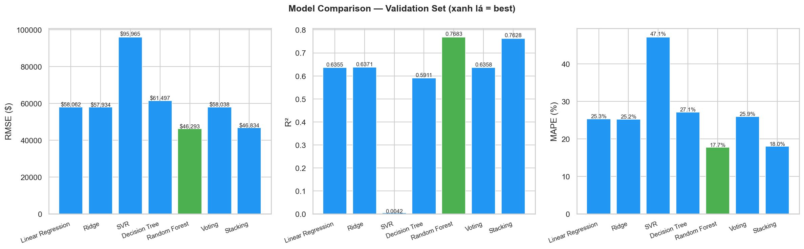
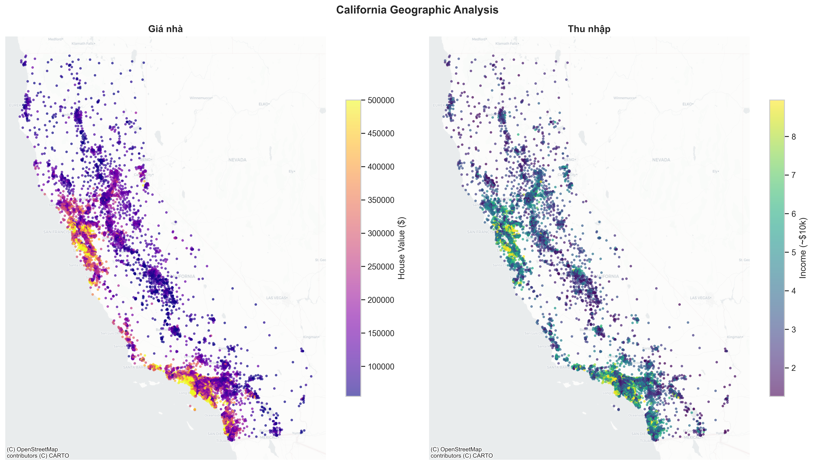

# California Housing Price Prediction (Production MLOps)


An end-to-end Machine Learning system that predicts California house values from census and geospatial features. Built with industry-standard **MLOps & DevOps practices**, including modular training pipelines, FastAPI microservice serving, automated testing, Docker Compose orchestration, Prometheus metrics, and automated Data Drift detection.

---

## Recruiter & Engineering Snapshot

- **Modular Training Pipeline (`src/`):** Tách rời hoàn toàn khỏi notebook sang kiến trúc module tự động hóa (`src/features`, `src/models/train.py`, `src/models/evaluate.py`).
- **Best Model (Stacking Regressor):** SVR + Random Forest base estimators kết hợp với Ridge meta-estimator, đạt test $R^2 \approx 0.82$, MAE $\approx \$30,300$.
- **High-Performance Serving:** FastAPI backend với Pydantic v2 validation, single & vectorized batch prediction (`/predict-batch`), pre-warming, và structured JSON logging.
- **Containerization:** Multi-stage `Dockerfile` tối ưu (< 200MB), non-root user, chạy với Gunicorn + Uvicorn workers.
- **Full-Stack Orchestration:** `docker-compose.yml` tích hợp sẵn **FastAPI API**, **React Nginx Frontend**, **Prometheus**, và **Grafana**.
- **Data Drift Detection:** Tự động kiểm tra độ lệch phân phối dữ liệu (Kolmogorov-Smirnov Test & Evidently reports) giữa dữ liệu production và baseline reference.
- **Automated CI/CD:** GitHub Actions workflow tự động chạy linting, test suite `pytest` (11 unit/integration tests), và đóng gói Docker image khi release.

---

## Preview

<p align="center">
  
  
</p>

---

## Production System Architecture

```text
                        +----------------------------+
                        |      React Frontend        |
                        |      (Nginx / Port 80)     |
                        +--------------+-------------+
                                       |
                                       v (Reverse Proxy / API Gateway)
+-------------------+   +--------------+-------------+   +-------------------+
|  Prometheus       |<--|      FastAPI Serving       |-->|  Prediction DB    |
|  (Metrics Scraper)|   |   (Gunicorn / Port 8000)   |   |  (SQLite / PG)    |
+---------+---------+   +--------------+-------------+   +---------+---------+
          |                            |                           |
          v                            v                           v
+---------+---------+   +--------------+-------------+   +---------+---------+
|  Grafana          |   |  Stacking Regressor Model  |   |  Data Drift Engine|
|  (Observability)  |   |  (models/*.joblib)         |   |  (KS-Test / Drift)|
+-------------------+   +----------------------------+   +-------------------+
```

---

## Repository Structure (Cookiecutter MLOps Standard)

```text
.
├── .github/workflows/
│   ├── ci.yml                          # Continuous Integration (Pytest, Build check)
│   └── cd.yml                          # Continuous Deployment (Docker Build & Push)
├── configs/                            # Model & training configuration YAML files
│   ├── data.yaml                       # Data paths & splitting parameters
│   └── stacking.yaml                   # Stacking Regressor model hyperparameters
├── data/                               # Data versioning directory
│   ├── raw/housing.csv                 # Original immutable dataset
│   ├── interim/                        # Cleaned intermediate datasets
│   ├── processed/                      # Model-ready train.csv and test.csv
│   └── external/sample_houses.json     # External test sample payloads
├── docs/                               # Project technical documentation
├── models/
│   ├── stacking_pipeline.joblib        # Serialized production pipeline
│   ├── model_metadata.json             # Model version & benchmark metadata
│   └── mlruns/                         # MLflow experiment tracking logs
├── references/                         # AI Canvas, problem definition & data dictionaries
├── reports/
│   └── figures/                        # Generated evaluation & EDA graphics
├── src/                                # Core MLOps Python package
│   ├── config.py                       # Global paths & hyperparameter constants
│   ├── data/                           # Data Engineering scripts
│   │   ├── ingestion.py                # Load raw data and check integrity
│   │   ├── cleaning.py                 # Impute nulls, remove anomalies
│   │   ├── splitting.py                # Reproducible Train/Test split
│   │   ├── build_features.py           # FeatureEngineering transformer & preprocessor
│   │   └── dataloader.py               # Dataset batch loader
│   ├── models/                         # ML Model Engineering
│   │   ├── evaluate.py                 # Evaluation metrics (RMSE, MAE, R², MAPE)
│   │   ├── mlflow_registry.py          # MLflow Model Registry integration
│   │   └── stacking/                   # Stacking Regressor implementation
│   │       ├── model.py                # Architecture definition
│   │       ├── train.py                # Training pipeline with YAML config
│   │       ├── predict.py              # Standalone inference runner
│   │       └── hyperparameters_tuning.py # RandomizedSearchCV tuning
│   ├── visualization/                  # Reporting and chart generators
│   │   ├── exploration.py              # EDA feature distributions & geographic plots
│   │   └── evaluation.py               # Actual vs Predicted & Residuals error plots
│   └── monitoring/                     # MLOps Observability
│       ├── drift_detector.py           # Two-sample KS-Test statistical drift detector
│       └── drift_worker.py             # Background periodic monitoring daemon
├── backend/                            # Serving Layer (FastAPI Microservice)
│   ├── app/
│   │   ├── api/v1/endpoints/           # Endpoints (health, predict, metrics, drift, enrichment)
│   │   ├── core/                       # Settings, structured JSON logging
│   │   ├── db/                         # Database connection & prediction history
│   │   ├── schemas/                    # Pydantic v2 schemas & request validation
│   │   ├── services/                   # Model loading, singleton inference & KDTree Feature Store
│   │   └── main.py                     # FastAPI application & Prometheus middleware
│   ├── Dockerfile                      # Production multi-stage Dockerfile
│   └── requirements.txt                # Serving dependencies
├── frontend/                           # React / Vite Dashboard (Map, UI, Metrics)
├── k8s/                                # Kubernetes manifests (Deployment, Service)
├── tests/                              # Automated Pytest suite
│   ├── unit/                           # Unit tests for data engineering & models
│   │   ├── test_features.py
│   │   └── test_models.py
│   └── integration/                    # Integration tests for API & Feature Store
│       ├── test_api.py
│       └── test_enrichment.py
├── Makefile                            # Enterprise project lifecycle commands
├── MLproject                           # MLflow execution recipe
├── pyproject.toml                      # Standard Python packaging (PEP 621)
├── docker-compose.yml                  # Full-stack production orchestration
└── pytest.ini                          # Pytest configuration
```

---

## Quickstart & Deployment Guide

### Option 1: Run Full Production Stack with Docker Compose (Recommended)

Khởi chạy toàn bộ hệ thống gồm API, Frontend, Prometheus, và Grafana:

```bash
docker-compose up --build -d
```

Truy cập các dịch vụ:
- **Frontend Dashboard:** [http://localhost:80](http://localhost:80)
- **FastAPI Interactive Docs:** [http://localhost:8000/docs](http://localhost:8000/docs)
- **Prometheus Metrics:** [http://localhost:9090](http://localhost:9090)
- **Grafana Monitoring:** [http://localhost:3001](http://localhost:3001) *(User: `admin`, Pass: `admin`)*

---

### Option 2: Run Locally (Development)

#### 1. Huấn luyện lại model artifact:
```bash
python -m src.models.train
```

#### 2. Chạy bộ kiểm thử tự động:
```bash
pytest -v
```

#### 3. Khởi động Backend API:
```bash
uvicorn backend.app.main:app --host 0.0.0.0 --port 8000 --reload
```

#### 4. Khởi động Frontend:
```bash
cd frontend
npm install
npm run dev
```

---

## Production API Endpoints Reference

| Method | Endpoint | Description |
| :--- | :--- | :--- |
| **GET** | `/health` | Service health status, model load check, uptime |
| **GET** | `/live` / `/ready` | Kubernetes Liveness and Readiness probes |
| **POST** | `/api/v1/predict` | Single house price prediction with Pydantic validation |
| **POST** | `/api/v1/predict-batch` | High-throughput batch prediction (up to 500 items) |
| **GET** | `/api/v1/history` | Latest prediction history records |
| **GET** | `/api/v1/metrics` | Model comparison benchmark matrix |
| **GET** | `/api/v1/drift-status` | Statistical Data Drift metrics in structured JSON |
| **GET** | `/api/v1/drift-report` | Visual HTML Data Drift dashboard |
| **GET** | `/prometheus-metrics` | Prometheus scraper endpoint |

---

## Testing & Quality Assurance

```bash
pytest -v
```
Output:
```text
tests/test_api.py::test_root_endpoint PASSED
tests/test_api.py::test_health_and_probes PASSED
tests/test_api.py::test_predict_endpoint_valid PASSED
tests/test_api.py::test_predict_endpoint_invalid_bounds PASSED
tests/test_api.py::test_predict_batch PASSED
tests/test_api.py::test_prometheus_metrics PASSED
tests/test_api.py::test_history_endpoint PASSED
tests/test_api.py::test_metrics_endpoint PASSED
tests/test_api.py::test_drift_status_endpoint PASSED
tests/test_model.py::test_model_loading_and_prediction PASSED
tests/test_model.py::test_batch_prediction PASSED

11 passed in ~11s
```

---

## License & Author

Built by [nvbao117](https://github.com/nvbao117) as an enterprise-grade Machine Learning & MLOps reference project.
